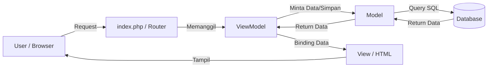

# TP10DPBO2425C2

# Janji
Saya Rifa Muhammad Danindra dengan Nim 2405981 mengerjakan tugas praktikum 10 dalam mata kuliah Desain Pemrograman Berorientasi Objek untuk keberkahan-Nya maka saya tidak akan melakukan kecurangan seperti yang telah di spesifikasikan Aamiin.

# 🧺 Sistem Informasi Manajemen Laundry (MVVM Architecture)

Aplikasi berbasis web sederhana untuk memanajemen operasional bisnis laundry. Aplikasi ini dibangun menggunakan **PHP Native** dengan menerapkan pola desain **MVVM (Model-View-ViewModel)** untuk memisahkan logika bisnis, akses data, dan antarmuka pengguna.


## 🚀 Fitur Utama

1.  **Manajemen Pelanggan**
    - Menambah, melihat, mengedit, dan menghapus data pelanggan.
2.  **Manajemen Layanan**
    - Mengelola jenis cucian (Cuci Komplit, Setrika, Dry Clean) beserta harga per kg.
3.  **Manajemen Pegawai**
    - Mengelola data karyawan dan jabatan (Kasir, Pencuci, dll).
4.  **Transaksi Laundry**
    - Mencatat transaksi baru dengan memilih Pelanggan dan Layanan.
    - **Hitung Otomatis:** Total bayar dihitung otomatis oleh sistem (`Berat` x `Harga Layanan`).
    - Riwayat transaksi lengkap.

## 🏗️ Desain & Arsitektur (MVVM)

### 1. Model (`models/`)
Bertanggung jawab untuk komunikasi langsung ke Database (Query SQL).
- Tidak ada logika bisnis di sini, hanya `INSERT`, `UPDATE`, `DELETE`, `SELECT`.
- Contoh: `Pelanggan.php`, `Transaksi.php`.

### 2. ViewModel (`viewmodels/`)
Bertindak sebagai perantara (jembatan) dan pengelola logika.
- Menerima input dari View.
- Memproses data (misal: menghitung total bayar).
- Mengirim data yang sudah matang ke Model atau View.
- Contoh: `TransaksiViewModel.php` (Menghitung `total = berat * harga`).

### 3. View (`views/`)
Bertanggung jawab untuk tampilan antarmuka (UI).
- Hanya berisi HTML dan sedikit PHP untuk menampilkan variabel `$data`.
- Tidak boleh ada Query SQL di sini.
- Contoh: `pelanggan_list.php`, `transaksi_form.php`.

---

## 🗂️ Struktur Database

Database: `laundry_db`

| Tabel | Primary Key | Keterangan | Relasi |
| :--- | :--- | :--- | :--- |
| `pelanggan` | `id_pelanggan` | Data customer | - |
| `layanan` | `id_layanan` | Data jasa & harga | - |
| `pegawai` | `id_pegawai` | Data karyawan | - |
| `transaksi` | `id_transaksi` | Data order masuk | `id_pelanggan` (FK), `id_layanan` (FK) |

---

## 📂 Struktur Folder

```text
Project_Laundry/
├── config/
│   └── Database.php          # Koneksi ke Database MySQL
├── database/
│   └── laundry.sql           # File import database
├── models/                   # Layer Akses Data
│   ├── Pelanggan.php
│   ├── Layanan.php
│   ├── Pegawai.php
│   └── Transaksi.php
├── viewmodels/               # Layer Logika Bisnis
│   ├── PelangganViewModel.php
│   ├── LayananViewModel.php
│   ├── PegawaiViewModel.php
│   └── TransaksiViewModel.php
├── views/                    # Layer Tampilan (UI)
│   ├── pelanggan_list.php
│   ├── pelanggan_form.php
│   ├── transaksi_list.php
│   └── ... (lainnya)
└── index.php                 # Routing Utama (Controller Sederhana)
```

## 🔄 Alur Kerja Program (Flow of Control)

Aplikasi ini menggunakan konsep **Single Entry Point**, di mana semua *request* dari pengguna akan masuk terlebih dahulu melalui `index.php`. Berikut adalah detail alur datanya:

### 1. Diagram Alur Umum (MVVM Cycle)

2. Skenario 1: Menampilkan Daftar Data (Read)
Contoh kasus: User membuka menu Data Pelanggan.

Request: User mengakses index.php?page=pelanggan_list.

Routing: index.php mengecek parameter page.

ViewModel: Router memanggil PelangganViewModel->fetchAll().

Model: ViewModel meminta PelangganModel untuk menjalankan query SELECT * FROM pelanggan.

View: Data yang dikembalikan Model diserahkan ke views/pelanggan_list.php untuk ditampilkan dalam bentuk tabel HTML.

3. Skenario 2: Menambah Data Baru (Create)
Contoh kasus: User mensubmit Form Tambah Pegawai.

Input: User mengisi form dan klik tombol "Simpan".

Routing: index.php mendeteksi method POST.

ViewModel: Router mengirim data $_POST ke PegawaiViewModel->insert().

Validasi: ViewModel memastikan input sesuai (misal: memetakan nama_pegawai dan jabatan).

Model: ViewModel mengirim data bersih ke PegawaiModel->create().

Database: Model menjalankan INSERT INTO pegawai ....

Redirect: Jika sukses, user diarahkan kembali ke halaman list.

4. Skenario 3: Logika Transaksi (Complex Logic)
Contoh kasus: User mencatat Transaksi Laundry. Ini adalah implementasi utama logika bisnis di ViewModel.

Input: User memilih Pelanggan, Layanan, dan memasukkan Berat (kg).

ViewModel Processing:

TransaksiViewModel menerima ID Layanan & Berat.

ViewModel secara otomatis mengecek database untuk mengambil harga per kg dari layanan yang dipilih.

Perhitungan: ViewModel menghitung Total Bayar = Berat (kg) * Harga Layanan.

Model: Hasil perhitungan (Total Bayar) beserta data lainnya dikirim ke TransaksiModel.

Simpan: Data transaksi lengkap disimpan ke database dengan status "Proses".


https://github.com/user-attachments/assets/6110d132-748a-49e7-bb60-023fd94a7ad7


